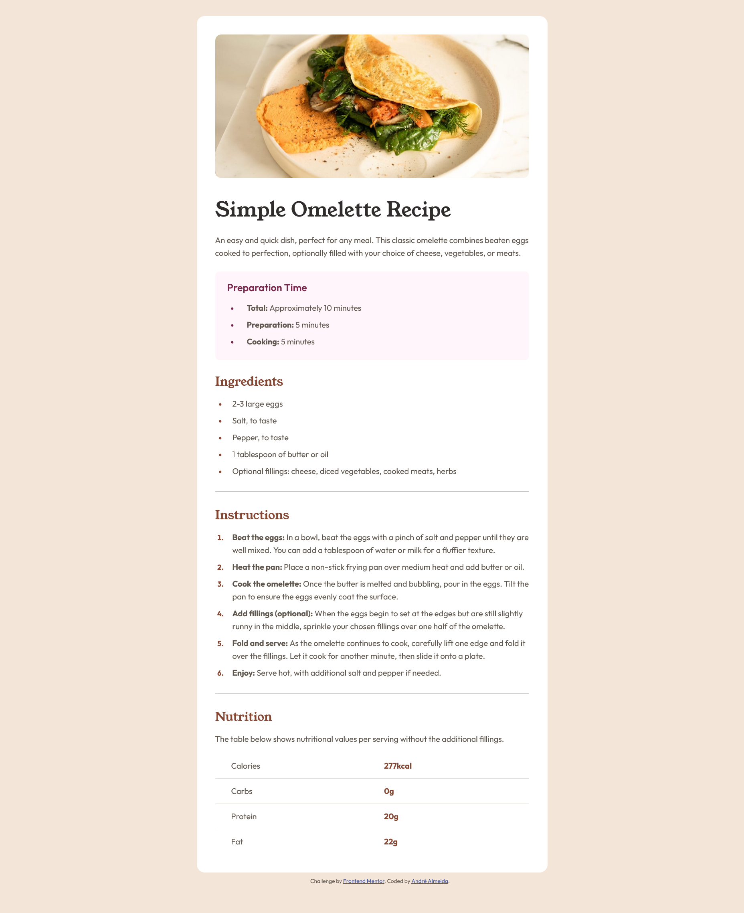

# Frontend Mentor - Recipe page solution

This is a solution to the [Recipe page challenge on Frontend Mentor](https://www.frontendmentor.io/challenges/recipe-page-KiTsR8QQKm). Frontend Mentor challenges help you improve your coding skills by building realistic projects.

## Table of contents

- [Overview](#overview)
  - [The challenge](#the-challenge)
  - [Screenshot](#screenshot)
  - [Links](#links)
- [My process](#my-process)
  - [Built with](#built-with)
  - [What I learned](#what-i-learned)
  - [Continued development](#continued-development)
- [Author](#author)

## Overview

### Screenshot

### Links

- Solution URL: [Recipe Page (GitHub)](https://github.com/andre-almeida-2121/recipe-page)
- Live Site URL: [Recipe Page (Vercel)](https://recipe-page-eight-phi.vercel.app/)

## My process

### Built with

- Semantic HTML5 markup
- CSS custom properties
- Flexbox
- Live Server
- Image preview
- Path Intellisense
- Prettier

### What I learned

I learned more about CSS custom properties, difference between sections and divs in HTML, how to create tables, etc. I must say I'm really happy right now with me, ho much I learned so far.

### Continued development

I intend to use what I learned here in future personal projects, as well as to work with any company.

## Author

- Linkedin - [André Almeida](https://www.linkedin.com/in/andr%C3%A9-almeida-0b6300324/)
- Github - [andre-almeida-2121](https://github.com/andre-almeida-2121)
- Portfolio - [André Almeida](https://ratiopitag.wixsite.com/meusite)
- Frontend Mentor - [@andre-almeida-2121](https://www.frontendmentor.io/profile/andre-almeida-2121)
